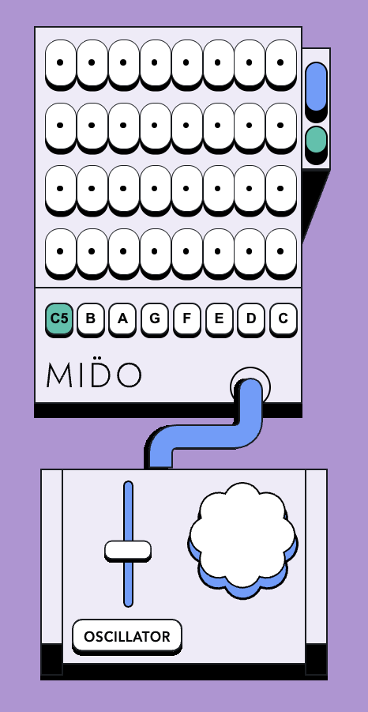

<p align="center">
  
</p>

# Mido

A minimal, browser-based step sequencer with a retro hardware aesthetic. Compose melodies across 4 tracks and 8 steps, choose from 8 built-in instruments or load your own JS soundfont, and control tempo — all in a single HTML file with soundfonts organized under `sounds/`.

## Features

- **4 × 8 step grid** — toggle steps on/off per track, each with an individual note
- **8 selectable notes** — C D E F G A B C5 across a one-octave range
- **8 built-in instruments + custom JS loader** — Oscillator, Ocarina, Synth Bass, Vibraphone, Synth Drum, Banjo, Steel Drums, Music Box, Grand Piano
- **BPM control** — drag the tempo slider or use the scroll wheel (40–300 BPM)
- **Shuffle** — randomize all steps with a single button
- **Clear** — reset the entire grid
- **Mute per track** — silence individual tracks via gamepad
- **Keyboard shortcuts** — full keyboard control (see below)
- **Gamepad support** — navigate and trigger steps with a connected controller
- **Accessible** — ARIA labels and a live status region throughout

## Getting Started

No build step or server required. Just open `index.html` in a browser.

> Built-in instrument soundfonts are loaded from separate `.js` files under `sounds/`. Use the `Custom` option in the instrument menu if you want to load your own local `.js` soundfont file from the browser.

```bash
# Quick local server with Python
python3 -m http.server
```

Then open `http://localhost:8000` in your browser.

## Custom Build JS

If you want to regenerate a custom soundfont from local audio files, use the helper in `build_custom/`.

```bash
cd build_custom
node build-soundfont.js
```

That script reads the samples in `build_custom/sounds/` and writes `build_custom/cat-mp3.js`.

To use the generated soundfont in Mido, copy the output file into `sounds/` so the app can load it like the other built-in instruments.

## Keyboard Shortcuts

| Key | Action |
|---|---|
| `Space` | Play / Stop |
| `Arrow Keys` | Move cursor across the grid |
| `Enter` | Toggle step on at cursor |
| `Backspace` / `Delete` | Clear step at cursor |
| `R` | Randomize all steps |
| `C` | Clear all steps |
| `F` | Fill current column |
| `G` | Fill current row |
| `Z` / `X` | Previous / Next note |
| `1` – `8` | Select note by position |
| `-` / `=` | Decrease / Increase BPM by 5 |

## Gamepad Mapping

| Button | Action |
|---|---|
| D-Pad | Move cursor |
| A (0) | Toggle step on |
| B (1) | Clear step |
| X (2) | Play / Stop |
| Y (3) | Preview cell |
| LB / RB (4/5) | Previous / Next note |
| LT (6) | Mute current track |

## File Structure

```
index.html                  # Main app (UI + sequencer logic)
readme.md                   # Project overview
build_custom/               # Helper script and source samples for generating a custom soundfont
  build-soundfont.js        # Node script that generates cat-mp3.js from local audio files
  cat-mp3.js                # Generated custom soundfont file
  sounds/                   # Source samples used by the build script
sounds/                     # Soundfont scripts
  acoustic_grand_piano-mp3.js # Soundfont: Grand Piano
  banjo-mp3.js                # Soundfont: Banjo
  cat-mp3.js                  # Extra soundfont file
  music_box-mp3.js            # Soundfont: Music Box
  ocarina-mp3.js              # Soundfont: Ocarina
  steel_drums-mp3.js          # Soundfont: Steel Drums
  synth_bass_1-mp3.js         # Soundfont: Synth Bass
  synth_drum-mp3.js           # Soundfont: Synth Drum
  vibraphone-mp3.js           # Soundfont: Vibraphone
```

## Browser Support

Any modern browser with Web Audio API support. Chrome and Firefox recommended. Safari works but may require a user gesture before audio initializes.

## License

MIT
